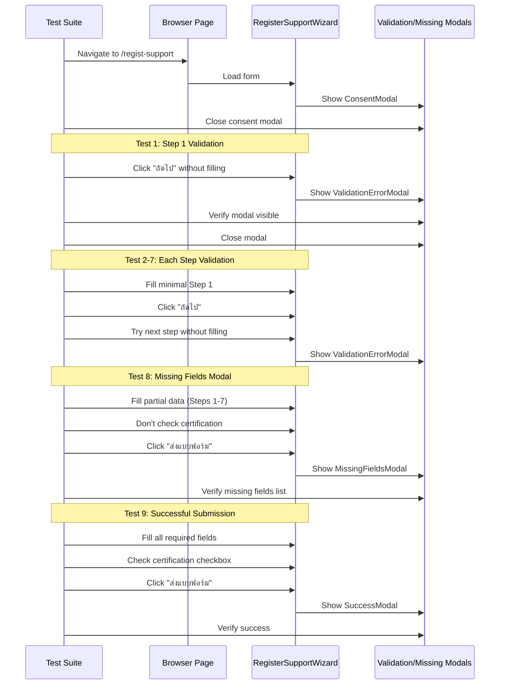

# Design Document: Regist-Support Validation Test

## Overview

การทดสอบ validation ครบวงจรสำหรับฟอร์ม regist-support ที่ http://localhost:3000/regist-support โดยอ้างอิงจาก pattern ของ register100-complete-validation-test.spec.ts ฟอร์มนี้เป็น multi-step form (8 steps) ที่มี validation ที่แต่ละ step และมี MissingFieldsModal component สำหรับแสดง missing fields เมื่อกด "ส่งแบบฟอร์ม"

## Main Test Flow

## Form Structure

### Step 1: ข้อมูลพื้นฐาน
**Required Fields:**
- schoolName (ชื่อสถานศึกษา) *
- schoolProvince (จังหวัด) *
- schoolLevel (ระดับสถานศึกษา) *

**Optional Fields:**
- supportType (ประเภท: สถานศึกษา/ชุมนุม/ชมรม/กลุ่ม/วงดนตรีไทย)
- supportTypeName
- supportTypeMemberCount
- affiliation (สังกัด)
- staffCount (จำนวนบุคลากร)
- studentCount (จำนวนนักเรียน)
- schoolSize (ขนาดโรงเรียน - auto-calculated)
- studentCountByGrade
- addressNo *, moo, road, subDistrict *, district *, provinceAddress *, postalCode *, phone *, fax

### Step 2: ผู้บริหารสถานศึกษา
**Required Fields:**
- mgtFullName (ชื่อ-นามสกุล) *
- mgtPosition (ตำแหน่ง) *
- mgtPhone (เบอร์โทรศัพท์) *
- mgtAddress *
- mgtEmail *

**Fields:**
- mgtImage (รูปภาพผู้บริหาร)

### Step 3: ความพร้อมในการส่งเสริม
**Fields:**
- readinessItems[] (เครื่องดนตรีไทย)
  - instrumentName
  - quantity
  - note

### Step 4: ผู้สอนดนตรีไทย
**Required Fields:**
- thaiMusicTeachers[]

**Fields:**
  - teacherQualification
  - teacherFullName
  - teacherPosition
  - teacherEducation
  - teacherPhone
  - teacherEmail
  - teacherImage
- isCompulsorySubject (checkbox)
- hasAfterSchoolTeaching (checkbox)
- hasElectiveSubject (checkbox)
- hasLocalCurriculum (checkbox)
- inClassInstructionDurations[]
- outOfClassInstructionDurations[]

### Step 5: ปัจจัยที่เกี่ยวข้อง
**Required Fields:**
- supportFactors[]
- awards[]

**Fields:**
- hasSupportFromOrg (checkbox)
- supportFromOrg[]
- hasSupportFromExternal (checkbox)
- supportFromExternal[]
- curriculumFramework
- learningOutcomes
- managementContext

### Step 6: ภาพถ่ายและวีดิโอ
**Fields:**
- photoGalleryLink
- videoLink

### Step 7: การเผยแพร่
**Fields:**
- activitiesWithinProvinceInternal[]
- activitiesWithinProvinceExternal[]
- activitiesOutsideProvince[]

### Step 8: การประชาสัมพันธ์และการรับรอง
**Fields:**
- prActivities[]
- heardFromSchool (checkbox)
- heardFromSchoolName, heardFromSchoolDistrict, heardFromSchoolProvince
- DCP_PR_Channel_FACEBOOK, DCP_PR_Channel_YOUTUBE, DCP_PR_Channel_Tiktok
- heardFromCulturalOffice (checkbox)
- heardFromCulturalOfficeName
- heardFromEducationArea (checkbox)
- heardFromEducationAreaName, heardFromEducationAreaProvince
- heardFromOther (checkbox)
- heardFromOtherDetail
- obstacles
- suggestions
**Required Fields:**
- **certifiedINFOByAdminName (checkbox) * - REQUIRED**
