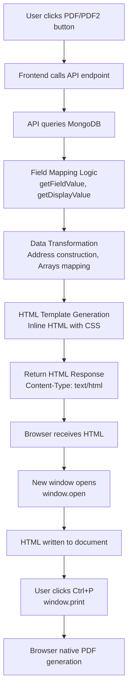
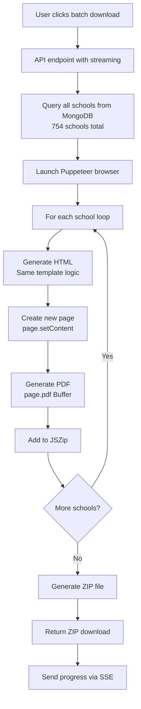

# รายงานการวิเคราะห์ระบบ PDF Export/Generation

**Project:** Thai Music School Platform  
**Date:** 2026-03-25  
**Analysis Type:** PDF Export System Architecture & Local Batch Generation Feasibility  
**Total Schools:** 754 (377 Register100 + 377 Register-Support)

---

## สารบัญ

- [A. RELEVANT FILE PATHS](#a-relevant-file-paths)
- [B. CURRENT PDF ARCHITECTURE / FLOW](#b-current-pdf-architecture--flow)
- [C. CORRECTED FIELD MAPPING](#c-corrected-field-mapping-source-of-truth)
- [D. PDF RENDERING MECHANISM](#d-pdf-rendering-mechanism)
- [E. SHARED COMPONENTS / UTILITIES](#e-shared-components--utilities)
- [F. DEPENDENCIES](#f-dependencies)
- [G. สิ่งที่สามารถ REUSE ได้](#g-สิ่งที่สามารถ-reuse-ได้)
- [H. สิ่งที่ต้อง REFACTOR](#h-สิ่งที่ต้อง-refactor)
- [I. RISKS / LIMITATIONS](#i-risks--limitations)
- [J. RECOMMENDED LOCAL BATCH ARCHITECTURE](#j-recommended-local-batch-architecture)
- [K. รายชื่อ FILE ที่จำเป็น](#k-รายชื่อ-file-ที่จำเป็นสำหรับ-local-batch-generator)

---

## A. RELEVANT FILE PATHS

### 📄 PDF Export Routes (API)

#### Register100 Routes
```
app/api/register100/[id]/export/pdf/route.ts
  └─ Full PDF HTML for window.print() (~20 pages)

app/api/register100/[id]/export/pdf-download/route.ts
  └─ Puppeteer wrapper for PDF download
```

#### Register-Support Routes
```
app/api/register-support/[id]/export/pdf/route.ts
  └─ Full PDF HTML for window.print() (~20 pages)

app/api/register-support/[id]/export/pdf-download/route.ts
  └─ Puppeteer wrapper for PDF download
```

#### School Page (Short Version)
```
app/api/school/[schoolId]/pdf/route.ts
  └─ PDF2 button - 1 page short version (Section 1 only)
```

#### Batch Generation Routes
```
app/api/schools/download-all-pdf/route.ts
  └─ Batch short version (uses Puppeteer)

app/api/schools/download-full-pdf/route.ts
  └─ Batch full version (uses Puppeteer)
```

### 🛠️ Utility Modules

```
lib/utils/schoolSize.ts
  └─ School size calculation & display transformation

lib/utils/gradeCalculator.ts
  └─ Grade calculation (A-F) for both types
```

### 🎨 Frontend Components

```
components/admin/SchoolsDataTable.tsx
  └─ Data table with PDF export buttons
```

---

## B. CURRENT PDF ARCHITECTURE / FLOW

### Flow 1: Browser Print (PDF & PDF2 Buttons) 🖨️



#### Key Characteristics:
- ❌ **NO Puppeteer** - Uses client-side browser print
- ✅ **Uses window.print()** - Native browser PDF engine
- 🔧 **Field mapping in API route** - getFieldValue/getDisplayValue
- 📝 **Inline HTML template** - String interpolation with embedded CSS
- 🎨 **Google Fonts (Sarabun)** - Loaded via CDN
- 🖼️ **Images via IMG tags** - ``

**API Endpoints:**
- Register100: `/api/register100/[id]/export/pdf`
- Register-Support: `/api/register-support/[id]/export/pdf`
- School Page (PDF2): `/api/school/[schoolId]/pdf`

---

### Flow 2: Puppeteer PDF Download (Batch Generation) 🤖



#### Key Characteristics:
- ✅ **Uses Puppeteer** - Server-side headless Chrome
- 📦 **Same HTML templates** - Reuses generatePDFHTML function
- 🔄 **Same field mapping** - Identical logic
- 📊 **Streaming progress** - Server-Sent Events (SSE)
- ⚠️ **High resource usage** - 754 schools in one batch
- ❌ **No individual error handling** - One failure stops all

**API Endpoints:**
- Short version batch: `/api/schools/download-all-pdf?type=register100&stream=true`
- Full version batch: `/api/schools/download-full-pdf?type=all&stream=true`

**Puppeteer Configuration:**
```typescript
await puppeteer.launch({
  headless: true,
  args: [
    '--no-sandbox',
    '--disable-setuid-sandbox',
    '--disable-dev-shm-usage',
    '--disable-gpu'
  ],
  timeout: 60000
});

await page.pdf({
  format: 'A4',
  printBackground: true,
  margin: {
    top: '15mm',
    right: '15mm',
    bottom: '15mm',
    left: '15mm'
  }
});
```

---

## C. CORRECTED FIELD MAPPING (Source of Truth)

### 📍 Location
- `app/api/register100/[id]/export/pdf/route.ts` (lines 26-39)
- `app/api/register-support/[id]/export/pdf/route.ts` (lines 26-34)
- `app/api/school/[schoolId]/pdf/route.ts` (lines 57-70)

### 🔧 Field Mapping Logic

```typescript
// Register100
const getFieldValue = (fieldName: string) => {
  return submission[`reg100_${fieldName}`] ?? submission[fieldName] ?? '';
};

// Register-Support
const getFieldValue = (fieldName: string) => {
  return submission[`regsup_${fieldName}`] ?? submission[fieldName] ?? '';
};

// Display transformation
const getDisplayValue = (fieldName: string) => {
  const value = getFieldValue(fieldName);
  if (fieldName === 'schoolSize') {
    return getSchoolSizeDisplayText(value) || value;
  }
  return value;
};
```

### 📋 Key Field Mappings (Section 1: ข้อมูลพื้นฐาน)

| Display Label | Database Field (Register100) | Database Field (Register-Support) | Transformation |
|--------------|------------------------------|-----------------------------------|----------------|
| ชื่อสถานศึกษา | `reg100_schoolName` | `regsup_schoolName` | None |
| จังหวัด | `reg100_schoolProvince` | `regsup_schoolProvince` | None |
| ระดับการศึกษา | `reg100_schoolLevel` | `regsup_schoolLevel` | None |
| สังกัด | `reg100_affiliation` | `regsup_affiliation` | None |
| ระบุ | `reg100_affiliationDetail` | `regsup_affiliationDetail` | None |
| ขนาดโรงเรียน | `reg100_schoolSize` | `regsup_schoolSize` | **getSchoolSizeDisplayText()** |
| จำนวนบุคลากร | `reg100_staffCount` | `regsup_staffCount` | None |
| จำนวนนักเรียน | `reg100_studentCount` | `regsup_studentCount` | None |
| จำนวนนักเรียนแต่ละชั้น | `reg100_studentCountByGrade` | `regsup_studentCountByGrade` | None |
| สถานที่ตั้ง | **Constructed from 8 fields** | **Constructed from 8 fields** | See below ⬇️ |
| โทรศัพท์ | `reg100_phone` | `regsup_phone` | None |
| โทรสาร | `reg100_fax` | `regsup_fax` | None |

### 🏠 Address Construction (สถานที่ตั้ง)

**Template:**
```typescript
`เลขที่ ${getFieldValue('addressNo')} 
${getFieldValue('moo') ? 'หมู่ ' + getFieldValue('moo') : ''} 
${getFieldValue('soi') ? 'ซอย ' + getFieldValue('soi') : ''} 
${getFieldValue('road') ? 'ถนน ' + getFieldValue('road') : ''} 
${getFieldValue('subDistrict') ? 'ตำบล/แขวง ' + getFieldValue('subDistrict') : ''} 
${getFieldValue('district') ? 'อำเภอ/เขต ' + getFieldValue('district') : ''} 
${getFieldValue('provinceAddress') ? 'จังหวัด ' + getFieldValue('provinceAddress') : ''} 
${getFieldValue('postalCode') ? getFieldValue('postalCode') : ''}`
```

**Database Fields:**
- `reg100_addressNo` / `regsup_addressNo`
- `reg100_moo` / `regsup_moo`
- `reg100_soi` / `regsup_soi` *(Note: ซอย field exists)*
- `reg100_road` / `regsup_road`
- `reg100_subDistrict` / `regsup_subDistrict`
- `reg100_district` / `regsup_district`
- `reg100_provinceAddress` / `regsup_provinceAddress`
- `reg100_postalCode` / `regsup_postalCode`

### 🔢 School Size Transformation

**Enum Values → Display Text:**
```typescript
'SMALL' → 'ขนาดเล็ก (119 คนลงมา)'
'MEDIUM' → 'ขนาดกลาง (120 - 719 คน)'
'LARGE' → 'ขนาดใหญ่ (720 - 1,679 คน)'
'EXTRA_LARGE' → 'ขนาดใหญ่พิเศษ (1,680 คนขึ้นไป)'
```

**Calculation Logic:**
```typescript
studentCount <= 119 → 'SMALL'
studentCount <= 719 → 'MEDIUM'
studentCount <= 1679 → 'LARGE'
studentCount >= 1680 → 'EXTRA_LARGE'
```

### 📊 Complex Fields (Arrays/Objects)

| Field Type | Register100 Field | Register-Support Field | Render Function |
|-----------|-------------------|------------------------|-----------------|
| Teachers | `reg100_thaiMusicTeachers` | `regsup_thaiMusicTeachers` | `renderTeachersData()` |
| Activities (Internal) | `reg100_activitiesWithinProvinceInternal` | `regsup_activitiesWithinProvinceInternal` | `renderActivities()` |
| Activities (External) | `reg100_activitiesWithinProvinceExternal` | `regsup_activitiesWithinProvinceExternal` | `renderActivities()` |
| Activities (Outside) | `reg100_activitiesOutsideProvince` | `regsup_activitiesOutsideProvince` | `renderActivities()` |
| Awards | `reg100_awards` | `regsup_awards` | Array mapping |
| Support (Internal) | `reg100_supportFromOrg` | `regsup_supportFromOrg` | Array mapping |
| Support (External) | `reg100_supportFromExternal` | `regsup_supportFromExternal` | Array mapping |
| Instruments | `reg100_readinessItems` | `regsup_readinessItems` | `renderReadinessItems()` |
| PR Activities | `reg100_prActivities` | `regsup_prActivities` | Array mapping |

---

## D. PDF RENDERING MECHANISM

### 🔀 Current System Uses TWO Methods

### Method 1: Browser Print (window.print()) 🖨️

**Used by:** PDF button, PDF2 button

**Process:**
1. API returns HTML string
2. Frontend opens new window (`window.open('', '_blank')`)
3. Writes HTML to `window.document`
4. Calls `window.print()`
5. User saves as PDF via browser dialog

**Pros:**
- ✅ Simple implementation
- ✅ No server load
- ✅ Native browser PDF engine
- ✅ Font rendering handled by browser

**Cons:**
- ❌ Requires user interaction
- ❌ Inconsistent output across browsers
- ❌ Cannot automate batch generation

**Implementation:**
```typescript
const printWindow = window.open('', '_blank');
if (printWindow) {
  printWindow.document.write(htmlContent);
  printWindow.document.close();
  printWindow.onload = () => {
    setTimeout(() => {
      printWindow.print();
    }, 500);
  };
}
```

---

### Method 2: Puppeteer (Server-side) 🤖

**Used by:** Batch ZIP downloads, individual PDF download endpoints

**Process:**
1. Launch headless Chrome
2. Create new page
3. Set HTML content (`page.setContent()`)
4. Generate PDF (`page.pdf()` → Buffer)
5. Return as file download or add to ZIP

**Pros:**
- ✅ Fully automated
- ✅ Consistent output
- ✅ No user interaction needed
- ✅ Can batch process

**Cons:**
- ❌ High server resource usage (CPU + Memory)
- ❌ Slow for large batches
- ❌ Requires Chromium installation
- ❌ Complex error handling

**Configuration:**
```typescript
// Browser launch
await puppeteer.launch({
  headless: true,
  args: [
    '--no-sandbox',
    '--disable-setuid-sandbox',
    '--disable-dev-shm-usage',
    '--disable-gpu'
  ],
  timeout: 60000
});

// PDF generation
const pdfBuffer = await page.pdf({
  format: 'A4',
  printBackground: true,
  margin: {
    top: '15mm',
    right: '15mm',
    bottom: '15mm',
    left: '15mm'
  }
});
```

**Performance Estimate:**
- Per PDF: 5-10 seconds
- 754 schools: **60-120 minutes total**
- Memory usage: ~2GB peak

---

## E. SHARED COMPONENTS / UTILITIES

### ✅ Currently Shared (Can Reuse)

#### 1. `lib/utils/schoolSize.ts`
```typescript
export function calculateSchoolSize(studentCount: number): SchoolSize
export function getSchoolSizeDisplayText(sizeEnum: string): string
```
**Status:** ✅ Ready to use as-is  
**Used by:** All PDF routes

#### 2. `lib/utils/gradeCalculator.ts`
```typescript
export function calculateGradeRegister100(score: number): string
export function calculateGrade(score: number, maxScore: 180): string
export function getGradeNameThai(grade: string): string
```
**Status:** ✅ Ready to use as-is  
**Used by:** DataTable, Excel export

**Grade Criteria:**

**Register100 (max 200):**
- A (ระดับดีเด่น): 160+ คะแนน
- B (ระดับดีมาก): 140-159 คะแนน
- C (ระดับดี): 120-139 คะแนน
- D (ระดับชมเชย): 100-119 คะแนน
- F (ต่ำกว่าเกณฑ์): 0-99 คะแนน

**Register-Support (max 180):**
- A (ระดับดีเด่น): 144+ คะแนน
- B (ระดับดีมาก): 126-143 คะแนน
- C (ระดับดี): 108-125 คะแนน
- D (ระดับชมเชย): 90-107 คะแนน
- F (ต่ำกว่าเกณฑ์): 0-89 คะแนน

---

### ❌ NOT Shared (Duplicated Code)

#### 1. HTML Templates
**Problem:** Inline HTML strings in 5 different routes
- `register100/[id]/export/pdf/route.ts` (full version)
- `register-support/[id]/export/pdf/route.ts` (full version)
- `school/[schoolId]/pdf/route.ts` (short version)
- `schools/download-all-pdf/route.ts` (batch short)
- `schools/download-full-pdf/route.ts` (batch full)

**Risk:** Updates must be applied to all 5 copies

#### 2. Field Mapping Logic
**Problem:** Duplicated `getFieldValue()` and `getDisplayValue()` in each route

**Risk:** Inconsistent mapping if one route is updated

#### 3. Render Helper Functions
**Problem:** Duplicated in each route:
- `renderTeachersData(teachers: any[])`
- `renderActivities(activities: any[], title: string)`
- `renderAwards(awards: any[])`
- `renderCurrentMusicTypes(items: any[])`
- `renderReadinessItems(items: any[])`
- `renderSupportFactors(factors: any[])`
- `renderSupportOrgs(orgs: any[], title: string)`

**Risk:** Bug fixes need to be replicated across all routes

---

## F. DEPENDENCIES

### 📦 Production Web Dependencies

#### Runtime
- **Next.js** 16.1.6 - Framework
- **React** 19.2.3 - UI library
- **MongoDB** 7.1.0 - Database driver

#### PDF Generation
- **Puppeteer** 25.9.0 - Only for batch generation

#### Assets
- **Google Fonts: Sarabun** - Loaded via CDN in HTML
- **Images** - Stored in `/public/uploads/`

#### Utilities
- **JSZip** 3.10.1 - For batch ZIP creation

---

### 🛠️ Local Batch Script Dependencies

#### Minimal Required
```json
{
  "dependencies": {
    "puppeteer": "^25.9.0",
    "typescript": "^5",
    "ts-node": "^10.9.2"
  }
}
```

#### Optional (If reading from DB)
```json
{
  "dependencies": {
    "mongodb": "^7.1.0"
  }
}
```

#### Built-in Node.js Modules
- `fs/promises` - File system operations
- `path` - Path manipulation
- No external dependencies needed ✅

---

### ❌ NOT Required for Local Batch

- ❌ Next.js framework
- ❌ React components
- ❌ API routes
- ❌ Authentication/Authorization
- ❌ Database write operations
- ❌ Web server
- ❌ Most environment variables

---

### ⚠️ Special Considerations

#### Fonts
**Current:** Google Fonts loaded via CDN  
**Problem:** Requires internet connection  
**Solution:** Bundle Sarabun fonts locally

#### Images
**Current:** `/uploads/mgt_123.jpg` (relative URLs)  
**Problem:** Not accessible in local script  
**Solution:** Copy to local folder, use `file://` URLs

---

## G. สิ่งที่สามารถ REUSE ได้

### ✅ Can Reuse Directly

#### 1. **HTML Templates** (with modifications)
- **Location:** Embedded in each PDF route as string templates
- **Need:** Extract to separate template files
- **Change Required:** Convert from Next.js API context to standalone functions
- **Effort:** Medium

**Example extraction:**
```typescript
// Before (in API route)
const htmlContent = `<!DOCTYPE html>...${getFieldValue('schoolName')}...`

// After (in template module)
export function renderRegister100PDF(data: MappedSchoolData): string {
  return `<!DOCTYPE html>...${data.schoolName}...`
}
```

---

#### 2. **Field Mapping Logic**
- **Location:** `getFieldValue()`, `getDisplayValue()` in each route
- **Need:** Extract to shared module `lib/pdf/fieldMapping.ts`
- **Usage:** Identical logic for web and batch
- **Effort:** Low

**Proposed structure:**
```typescript
// lib/pdf/fieldMapping.ts
export function mapSchoolData(
  submission: any,
  type: 'register100' | 'register-support',
  imageBasePath?: string
): MappedSchoolData {
  const prefix = type === 'register100' ? 'reg100_' : 'regsup_';
  
  const getField = (name: string) => {
    return submission[`${prefix}${name}`] ?? submission[name] ?? '';
  };
  
  return {
    schoolName: getField('schoolName'),
    schoolProvince: getField('schoolProvince'),
    schoolSize: getSchoolSizeDisplayText(getField('schoolSize')),
    address: buildAddress(submission, prefix),
    mgtImage: resolveImagePath(getField('mgtImage'), imageBasePath),
    // ... all other fields
  };
}
```

---

#### 3. **Render Helper Functions**
- **Location:** Scattered across routes
- **Need:** Extract to `lib/pdf/renderHelpers.ts`
- **Usage:** Identical HTML generation
- **Effort:** Low

**Functions to extract:**
```typescript
export function renderTeachersData(teachers: any[]): string
export function renderActivities(activities: any[], title: string): string
export function renderAwards(awards: any[]): string
export function renderCurrentMusicTypes(items: any[]): string
export function renderReadinessItems(items: any[]): string
export function renderSupportFactors(factors: any[]): string
```

---

#### 4. **Utility Functions**
- **schoolSize.ts** - ✅ Ready to use as-is
- **gradeCalculator.ts** - ✅ Ready to use as-is
- **Effort:** None

---

#### 5. **CSS Styles**
- **Location:** Embedded in HTML templates
- **Need:** Can extract to separate file or keep inline
- **Usage:** Copy directly
- **Effort:** Minimal

---

#### 6. **Data Structure Knowledge**
- ✅ Field naming conventions (`reg100_`, `regsup_`)
- ✅ Database schema understanding
- ✅ Documented and consistent
- **Effort:** None (already documented)

---

## H. สิ่งที่ต้อง REFACTOR

### 🔧 Refactoring Requirements

#### 1. **Template Extraction** 🚨 HIGH PRIORITY

**Current State:**
```typescript
// Inline in API route
const htmlContent = `
<!DOCTYPE html>
<html>
  <head>...</head>
  <body>
    ${getFieldValue('schoolName')}
    ...
  </body>
</html>
`;
```

**Target State:**
```typescript
// lib/pdf/templates/register100Full.ts
export function renderRegister100FullPDF(data: MappedSchoolData): string {
  return `
<!DOCTYPE html>
<html>
  <head>...</head>
  <body>
    ${data.schoolName}
    ...
  </body>
</html>
`;
}
```

**Why:**
- Hard to maintain 5 duplicate templates
- Can't share between web and batch
- Testing is difficult

**Effort:** Medium  
**Risk:** Low (pure extraction)

---

#### 2. **Field Mapping Module** 🚨 HIGH PRIORITY

**Current State:** Duplicated in each route

**Target State:**
```typescript
// lib/pdf/fieldMapping.ts
export interface MappedSchoolData {
  schoolId: string;
  schoolName: string;
  schoolProvince: string;
  schoolLevel: string;
  affiliation: string;
  affiliationDetail: string;
  schoolSize: string; // Already transformed
  staffCount: string;
  studentCount: string;
  studentCountByGrade: string;
  address: string; // Already constructed
  phone: string;
  fax: string;
  mgtImage: string; // Resolved path
  mgtFullName: string;
  // ... all other fields
}

export function mapSchoolData(
  submission: any,
  type: 'register100' | 'register-support',
  imageBasePath?: string
): MappedSchoolData {
  // Centralized mapping logic
}

function buildAddress(submission: any, prefix: string): string {
  // Address construction logic
}

function resolveImagePath(path: string, basePath?: string): string {
  // Convert relative URL to absolute path for local
  if (basePath) {
    return `file://${basePath}/${path.replace('/uploads/', '')}`;
  }
  return path;
}
```

**Why:**
- Single source of truth
- Can fix bugs in one place
- Easier to test

**Effort:** Medium  
**Risk:** Medium (needs testing)

---

#### 3. **Template Rendering Module** 🔶 MEDIUM PRIORITY

**Current State:** Mixed with API route logic

**Target State:**
```typescript
// lib/pdf/templateRenderer.ts
export function renderPDF(
  data: MappedSchoolData,
  template: 'full' | 'short',
  type: 'register100' | 'register-support'
): string {
  // Pure function: data → HTML
  if (type === 'register100') {
    return template === 'full'
      ? renderRegister100FullPDF(data)
      : renderRegister100ShortPDF(data);
  } else {
    return template === 'full'
      ? renderRegisterSupportFullPDF(data)
      : renderRegisterSupportShortPDF(data);
  }
}
```

**Why:**
- Clear separation of concerns
- Easy to test
- Can use in both web and batch

**Effort:** Low  
**Risk:** Low

---

#### 4. **Image Path Handling** 🔶 MEDIUM PRIORITY

**Current State:**
```html

```

**Target State for Web:**
```html

```

**Target State for Local Batch:**
```html

```

**Implementation:**
```typescript
function resolveImagePath(
  relativePath: string,
  mode: 'web' | 'local',
  localBasePath?: string
): string {
  if (mode === 'web') {
    return relativePath;
  }
  
  if (mode === 'local' && localBasePath) {
    const filename = relativePath.replace('/uploads/', '');
    return `file:///${localBasePath}/${filename}`.replace(/\\/g, '/');
  }
  
  return relativePath;
}
```

**Why:**
- Images must be accessible during PDF generation
- Web uses relative URLs
- Local batch needs absolute file paths

**Effort:** Low  
**Risk:** Low

---

#### 5. **MongoDB Dependency Removal** ⚠️ OPTIONAL

**Current State:** Direct MongoDB queries in API

**Target State:** JSON input for batch script

**Solution:**
```bash
# Export data to JSON
mongoexport --db=thai_music_school \
  --collection=register100_submissions \
  --out=register100_submissions.json

mongoexport --db=thai_music_school \
  --collection=register_support_submissions \
  --out=register_support_submissions.json
```

**Why:**
- No need to connect to production DB
- Safer for batch generation
- Can work offline

**Effort:** None (just data export)  
**Risk:** None

---

## I. RISKS / LIMITATIONS

### 🚨 Current System Risks

#### 1. **Batch Generation Resource Usage**
- **Problem:** 754 schools × Puppeteer = Very high memory/CPU
- **Impact:** Can cause server crash or timeout
- **Current State:** ❌ No resource limits
- **Mitigation:** None implemented

**Performance Metrics:**
```
Per school: ~5-10 seconds
Total time: 60-120 minutes
Peak memory: ~2GB
CPU usage: 80-100%
```

---

#### 2. **Template Inconsistency**
- **Problem:** 5 different template copies
- **Impact:** Updates must be applied to all copies
- **Risk:** Field mapping errors, missing data
- **Example:** Recent fix to PDF2 needed to be replicated manually

**Template Locations:**
1. `register100/[id]/export/pdf/route.ts`
2. `register-support/[id]/export/pdf/route.ts`
3. `school/[schoolId]/pdf/route.ts`
4. `schools/download-all-pdf/route.ts`
5. `schools/download-full-pdf/route.ts`

---

#### 3. **No Retry Mechanism**
- **Problem:** If one school fails, entire batch may fail
- **Current Behavior:**
  ```typescript
  for (const school of schools) {
    const pdf = await generatePDF(school); // If this throws...
    zip.file(filename, pdf); // ...rest of batch stops
  }
  ```
- **Missing:**
  - Individual try-catch
  - Error logging per school
  - Resume capability
  - Partial success reporting

---

#### 4. **Image Dependency**
- **Problem:** Images must be accessible during PDF generation
- **Risks:**
  - Broken image URLs → broken PDFs
  - Missing images → blank spaces
  - Network issues for remote images
- **No Validation:** Images not checked before generation

**Image Path Examples:**
```
/uploads/mgt_1777358270947_ผู้อำนวยการ ร.ร.วัดคลองบางเดื่อ.jpg
/uploads/teacher_0_1777358270999_ครูสมชาย.jpg
```

---

### ⚠️ Local Batch Limitations

#### 1. **Image Access** 🖼️
**Challenge:** Images stored on server need to be copied locally

**Current Location:**
```
Server: /public/uploads/
Size: Unknown (potentially GB)
```

**Required Action:**
```bash
# Copy images from server to local
rsync -avz server:/path/to/public/uploads/ ./server-image/

# Or via scp
scp -r server:/path/to/public/uploads/ ./server-image/
```

**Considerations:**
- Folder size could be large (>1GB)
- Need stable connection for transfer
- Disk space on local machine

---

#### 2. **Font Availability** 🔤
**Current:** Google Fonts loaded via CDN

**HTML Template:**
```html
<link href="https://fonts.googleapis.com/css2?family=Sarabun:wght@300;400;500;600;700&display=swap" rel="stylesheet">
```

**Problem:** Requires internet connection

**Solutions:**

**Option A: Continue using CDN**
- ✅ Simple
- ❌ Requires internet
- ❌ Slower PDF generation

**Option B: Bundle fonts locally**
```bash
# Download Sarabun fonts
wget https://fonts.google.com/download?family=Sarabun

# Reference locally
<style>
  @font-face {
    font-family: 'Sarabun';
    src: url('file:///path/to/fonts/Sarabun-Regular.ttf');
  }
</style>
```
- ✅ Works offline
- ✅ Faster
- ❌ More setup

---

#### 3. **Puppeteer Performance** ⏱️

**Time Estimates:**
```
Per PDF:      5-10 seconds
754 schools:  60-120 minutes total
```

**Memory Usage:**
```
Per page:     ~50-100MB
Peak:         ~2GB with browser pool
```

**Recommendations:**
- Run overnight
- Monitor progress
- Save checkpoints
- Allow resume

---

#### 4. **JSON Export Size** 📦

**Estimate:**
```
Per school:   ~50-100KB JSON
754 schools:  ~38-75MB total
```

**Structure:**
```
data/
├── register100_submissions.json     (~20MB)
└── register_support_submissions.json (~20MB)
```

**Considerations:**
- Need efficient parsing
- Memory usage when loading all
- Consider streaming for very large datasets

---

## J. RECOMMENDED LOCAL BATCH ARCHITECTURE

### 📊 Architecture Overview

```
┌─────────────────────────────────────────────────────────┐
│  STEP 0: PREPARATION (Manual/One-time)                  │
├─────────────────────────────────────────────────────────┤
│  1. Export MongoDB to JSON                              │
│     mongoexport → register100_submissions.json          │
│     mongoexport → register_support_submissions.json     │
│                                                          │
│  2. Copy images from server to local                    │
│     rsync/scp → ./server-image/                         │
│                                                          │
│  3. (Optional) Download Sarabun fonts locally           │
└─────────────────────────────────────────────────────────┘
               ↓
┌─────────────────────────────────────────────────────────┐
│  STEP 1: REFACTOR EXISTING CODE (Safe changes)          │
├─────────────────────────────────────────────────────────┤
│  1. Extract field mapping                               │
│     → lib/pdf/fieldMapping.ts                           │
│                                                          │
│  2. Extract template functions                          │
│     → lib/pdf/templates/register100Full.ts              │
│     → lib/pdf/templates/register100Short.ts             │
│     → lib/pdf/templates/registerSupportFull.ts          │
│     → lib/pdf/templates/registerSupportShort.ts         │
│                                                          │
│  3. Extract render helpers                              │
│     → lib/pdf/renderHelpers.ts                          │
│                                                          │
│  4. Update existing API routes to use shared modules    │
│                                                          │
│  5. Test web PDF generation                             │
│     ✅ Ensure no breaking changes                       │
└─────────────────────────────────────────────────────────┘
               ↓
┌─────────────────────────────────────────────────────────┐
│  STEP 2: CREATE BATCH SCRIPT                            │
├─────────────────────────────────────────────────────────┤
│  scripts/batch-pdf-generator.ts                         │
│                                                          │
│  Input Sources:                                          │
│    • data/register100_submissions.json                  │
│    • data/register_support_submissions.json             │
│    • server-image/ folder                               │
│                                                          │
│  Processing Pipeline:                                    │
│    1. Load JSON data                                    │
│    2. Initialize Puppeteer browser                      │
│    3. For each school (with error handling):            │
│       a. Map fields (shared module)                     │
│       b. Resolve image paths to local files             │
│       c. Generate HTML (shared template)                │
│       d. Generate PDF via Puppeteer                     │
│       e. Calculate grade                                │
│       f. Determine output folder by grade               │
│       g. Save PDF with correct filename                 │
│       h. Log result to report                           │
│       i. Continue on error (don't stop)                 │
│    4. Close browser                                     │
│    5. Generate summary report                           │
│                                                          │
│  Error Handling:                                         │
│    • Individual try-catch per school                    │
│    • Log errors but continue                            │
│    • Track success/failure counts                       │
│    • Generate detailed error report                     │
│                                                          │
│  Output:                                                 │
│    • PDFs organized by type and grade                   │
│    • CSV report with all results                        │
│    • Error log for failed schools                       │
└─────────────────────────────────────────────────────────┘
               ↓
┌─────────────────────────────────────────────────────────┐
│  STEP 3: OUTPUT STRUCTURE                               │
├─────────────────────────────────────────────────────────┤
│  output/                                                 │
│  ├── register100/                                       │
│  │   ├── ระดับดีเด่น/                                  │
│  │   │   ├── โรงเรียนวัดไทร ลำดับที่ SCH-xxx.pdf      │
│  │   │   └── โรงเรียนบ้านหนองบัว ลำดับที่ SCH-yyy.pdf  │
│  │   ├── ระดับดีมาก/                                   │
│  │   ├── ระดับดี/                                       │
│  │   ├── ระดับชมเชย/                                   │
│  │   └── ต่ำกว่าเกณฑ์/                                 │
│  ├── register-support/                                  │
│  │   ├── ระดับดีเด่น/                                  │
│  │   ├── ระดับดีมาก/                                   │
│  │   ├── ระดับดี/                                       │
│  │   ├── ระดับชมเชย/                                   │
│  │   └── ต่ำกว่าเกณฑ์/                                 │
│  ├── generation-report.csv                              │
│  └── error-log.txt                                      │
└─────────────────────────────────────────────────────────┘
```

---

### 💻 Batch Script Implementation

```typescript
// scripts/batch-pdf-generator.ts

import puppeteer, { Browser } from 'puppeteer';
import fs from 'fs/promises';
import path from 'path';
import { mapSchoolData, MappedSchoolData } from '../lib/pdf/fieldMapping';
import { renderPDF } from '../lib/pdf/templateRenderer';
import { 
  calculateGradeRegister100, 
  calculateGrade, 
  getGradeNameThai 
} from '../lib/utils/gradeCalculator';

// ────────────────────────────────────────────────────────
// Types
// ────────────────────────────────────────────────────────

interface GenerationResult {
  schoolId: string;
  schoolName: string;
  type: 'register100' | 'register-support';
  grade: string;
  gradeThai: string;
  status: 'success' | 'failure';
  filename: string;
  error?: string;
  duration: number;
}

interface Config {
  outputDir: string;
  imageBasePath: string;
  register100Path: string;
  registerSupportPath: string;
  templateVersion: 'full' | 'short';
  puppeteerTimeout: number;
}

// ────────────────────────────────────────────────────────
// Configuration
// ────────────────────────────────────────────────────────

const CONFIG: Config = {
  outputDir: './output',
  imageBasePath: './server-image',
  register100Path: './data/register100_submissions.json',
  registerSupportPath: './data/register_support_submissions.json',
  templateVersion: 'full', // or 'short'
  puppeteerTimeout: 30000, // 30 seconds per PDF
};

// ────────────────────────────────────────────────────────
// PDF Generation Function
// ────────────────────────────────────────────────────────

async function generatePDF(
  submission: any,
  type: 'register100' | 'register-support',
  browser: Browser,
  config: Config
): Promise<GenerationResult> {
  const startTime = Date.now();
  const schoolId = submission.schoolId || 'UNKNOWN';
  
  try {
    console.log(`  Processing: ${schoolId}`);
    
    // 1. Map fields using shared module
    const mappedData: MappedSchoolData = mapSchoolData(
      submission,
      type,
      config.imageBasePath
    );
    
    // 2. Calculate grade
    const totalScore = 
      (submission.total_score || 0) +
      (submission.video1_score || 0) +
      (submission.video2_score || 0);
    
    const grade = type === 'register100'
      ? calculateGradeRegister100(totalScore)
      : calculateGrade(totalScore, 180);
    
    const gradeThai = getGradeNameThai(grade);
    
    // 3. Generate HTML using shared template
    const html = renderPDF(mappedData, config.templateVersion, type);
    
    // 4. Generate PDF with Puppeteer
    const page = await browser.newPage();
    
    await page.setContent(html, {
      waitUntil: 'networkidle0',
      timeout: config.puppeteerTimeout
    });
    
    // 5. Determine output path
    const schoolName = mappedData.schoolName || schoolId;
    const safeSchoolName = schoolName
      .replace(/[^a-zA-Z0-9ก-๙\s]/g, '')
      .substring(0, 50);
    
    const filename = `${safeSchoolName} ลำดับที่ ${schoolId}.pdf`;
    const gradePath = path.join(
      config.outputDir,
      type,
      gradeThai
    );
    
    // 6. Create directory if not exists
    await fs.mkdir(gradePath, { recursive: true });
    
    const filepath = path.join(gradePath, filename);
    
    // 7. Save PDF
    await page.pdf({
      path: filepath,
      format: 'A4',
      printBackground: true,
      margin: {
        top: '15mm',
        right: '15mm',
        bottom: '15mm',
        left: '15mm'
      }
    });
    
    await page.close();
    
    console.log(`  ✅ Success: ${gradeThai} (${Date.now() - startTime}ms)`);
    
    return {
      schoolId,
      schoolName,
      type,
      grade,
      gradeThai,
      status: 'success',
      filename: filepath,
      duration: Date.now() - startTime
    };
    
  } catch (error: any) {
    console.error(`  ❌ Failed: ${error.message}`);
    
    return {
      schoolId,
      schoolName: submission.reg100_schoolName || 
                  submission.regsup_schoolName || 
                  schoolId,
      type,
      grade: 'F',
      gradeThai: 'ต่ำกว่าเกณฑ์',
      status: 'failure',
      filename: '',
      error: error.message,
      duration: Date.now() - startTime
    };
  }
}

// ────────────────────────────────────────────────────────
// Report Generation
// ────────────────────────────────────────────────────────

async function generateReport(
  results: GenerationResult[],
  outputPath: string
): Promise<void> {
  const csvHeader = [
    'School ID',
    'School Name',
    'Type',
    'Grade',
    'Grade Thai',
    'Status',
    'Filename',
    'Error',
    'Duration (ms)'
  ].join(',') + '\n';
  
  const csvRows = results.map(r => {
    const escape = (str: string) => `"${str.replace(/"/g, '""')}"`;
    return [
      escape(r.schoolId),
      escape(r.schoolName),
      escape(r.type),
      escape(r.grade),
      escape(r.gradeThai),
      escape(r.status),
      escape(r.filename),
      escape(r.error || ''),
      r.duration
    ].join(',');
  }).join('\n');
  
  await fs.writeFile(outputPath, csvHeader + csvRows, 'utf-8');
}

// ────────────────────────────────────────────────────────
// Main Function
// ────────────────────────────────────────────────────────

async function main() {
  console.log('🚀 PDF Batch Generator Starting...\n');
  console.log('Configuration:');
  console.log(`  Output: ${CONFIG.outputDir}`);
  console.log(`  Images: ${CONFIG.imageBasePath}`);
  console.log(`  Template: ${CONFIG.templateVersion}`);
  console.log(`  Timeout: ${CONFIG.puppeteerTimeout}ms\n`);
  
  // Load data
  console.log('📂 Loading data...');
  const register100Data = JSON.parse(
    await fs.readFile(CONFIG.register100Path, 'utf-8')
  );
  const registerSupportData = JSON.parse(
    await fs.readFile(CONFIG.registerSupportPath, 'utf-8')
  );
  
  const total = register100Data.length + registerSupportData.length;
  console.log(`  Register100: ${register100Data.length} schools`);
  console.log(`  Register-Support: ${registerSupportData.length} schools`);
  console.log(`  Total: ${total} schools\n`);
  
  const results: GenerationResult[] = [];
  
  // Launch Puppeteer
  console.log('🌐 Launching browser...');
  const browser = await puppeteer.launch({
    headless: true,
    args: [
      '--no-sandbox',
      '--disable-setuid-sandbox',
      '--disable-dev-shm-usage',
      '--disable-gpu'
    ]
  });
  console.log('  ✅ Browser ready\n');
  
  let current = 0;
  
  // Process Register100
  console.log('📄 Processing Register100...');
  for (const submission of register100Data) {
    current++;
    console.log(`[${current}/${total}] ${submission.schoolId || 'UNKNOWN'}`);
    const result = await generatePDF(
      submission,
      'register100',
      browser,
      CONFIG
    );
    results.push(result);
  }
  
  // Process Register-Support
  console.log('\n📄 Processing Register-Support...');
  for (const submission of registerSupportData) {
    current++;
    console.log(`[${current}/${total}] ${submission.schoolId || 'UNKNOWN'}`);
    const result = await generatePDF(
      submission,
      'register-support',
      browser,
      CONFIG
    );
    results.push(result);
  }
  
  // Close browser
  await browser.close();
  console.log('\n✅ Browser closed');
  
  // Generate reports
  console.log('\n📊 Generating reports...');
  await generateReport(
    results,
    path.join(CONFIG.outputDir, 'generation-report.csv')
  );
  
  // Generate error log
  const errors = results.filter(r => r.status === 'failure');
  if (errors.length > 0) {
    const errorLog = errors.map(e =>
      `[${e.schoolId}] ${e.schoolName}\n  Error: ${e.error}\n`
    ).join('\n');
    await fs.writeFile(
      path.join(CONFIG.outputDir, 'error-log.txt'),
      errorLog,
      'utf-8'
    );
  }
  
  // Summary
  const success = results.filter(r => r.status === 'success').length;
  const failures = results.filter(r => r.status === 'failure').length;
  const totalDuration = results.reduce((sum, r) => sum + r.duration, 0);
  const avgDuration = Math.round(totalDuration / results.length);
  
  console.log('\n' + '='.repeat(60));
  console.log('📊 SUMMARY REPORT');
  console.log('='.repeat(60));
  console.log(`  Total Schools:     ${total}`);
  console.log(`  ✅ Success:        ${success} (${Math.round(success/total*100)}%)`);
  console.log(`  ❌ Failures:       ${failures} (${Math.round(failures/total*100)}%)`);
  console.log(`  ⏱️  Total Duration:  ${Math.round(totalDuration/1000/60)} minutes`);
  console.log(`  ⏱️  Avg per PDF:     ${avgDuration}ms`);
  console.log('='.repeat(60));
  
  // Grade distribution
  console.log('\n📈 Grade Distribution:');
  const gradeCount = results.reduce((acc, r) => {
    acc[r.gradeThai] = (acc[r.gradeThai] || 0) + 1;
    return acc;
  }, {} as Record<string, number>);
  
  Object.entries(gradeCount)
    .sort(([,a], [,b]) => b - a)
    .forEach(([grade, count]) => {
      console.log(`  ${grade}: ${count} schools`);
    });
  
  console.log('\n✅ Report saved to:');
  console.log(`  ${path.join(CONFIG.outputDir, 'generation-report.csv')}`);
  if (errors.length > 0) {
    console.log(`  ${path.join(CONFIG.outputDir, 'error-log.txt')}`);
  }
  
  console.log('\n🎉 Done!\n');
}

// ────────────────────────────────────────────────────────
// Run
// ────────────────────────────────────────────────────────

main().catch(error => {
  console.error('💥 Fatal error:', error);
  process.exit(1);
});
```

---

### 📝 Usage Instructions

#### 1. **Preparation**

```bash
# Create directories
mkdir -p data server-image output

# Export MongoDB data
mongoexport --uri="mongodb://localhost:27017/thai_music_school" \
  --collection=register100_submissions \
  --out=data/register100_submissions.json

mongoexport --uri="mongodb://localhost:27017/thai_music_school" \
  --collection=register_support_submissions \
  --out=data/register_support_submissions.json

# Copy images from server
rsync -avz server:/path/to/public/uploads/ ./server-image/
```

#### 2. **Install Dependencies**

```bash
npm install puppeteer typescript ts-node @types/node
```

#### 3. **Run Script**

```bash
# Run batch generator
npx ts-node scripts/batch-pdf-generator.ts

# Or with npm script
npm run batch:pdf
```

#### 4. **Check Output**

```bash
# View report
cat output/generation-report.csv

# Check errors (if any)
cat output/error-log.txt

# Count PDFs generated
find output -name "*.pdf" | wc -l
```

---

### 🎯 Expected Output Structure

```
output/
├── register100/
│   ├── ระดับดีเด่น/
│   │   ├── โรงเรียนวัดไทร ลำดับที่ SCH-20260612-0787.pdf
│   │   ├── โรงเรียนบ้านหนองบัว ลำดับที่ SCH-20260612-0823.pdf
│   │   └── ... (more PDFs)
│   ├── ระดับดีมาก/
│   │   └── ... (PDFs with grade B)
│   ├── ระดับดี/
│   │   └── ... (PDFs with grade C)
│   ├── ระดับชมเชย/
│   │   └── ... (PDFs with grade D)
│   └── ต่ำกว่าเกณฑ์/
│       └── ... (PDFs with grade F)
│
├── register-support/
│   ├── ระดับดีเด่น/
│   ├── ระดับดีมาก/
│   ├── ระดับดี/
│   ├── ระดับชมเชย/
│   └── ต่ำกว่าเกณฑ์/
│
├── generation-report.csv
└── error-log.txt (if there are errors)
```

---

### 📊 Report Format

**generation-report.csv:**
```csv
School ID,School Name,Type,Grade,Grade Thai,Status,Filename,Error,Duration (ms)
"SCH-20260612-0787","โรงเรียนวัดไทร","register100","A","ระดับดีเด่น","success","output/register100/ระดับดีเด่น/โรงเรียนวัดไทร ลำดับที่ SCH-20260612-0787.pdf","",5432
"SCH-20260612-0823","โรงเรียนบ้านหนองบัว","register100","B","ระดับดีมาก","success","output/register100/ระดับดีมาก/โรงเรียนบ้านหนองบัว ลำดับที่ SCH-20260612-0823.pdf","",6124
"SCH-20260612-0999","โรงเรียนบ้านทุ่งนา","register100","F","ต่ำกว่าเกณฑ์","failure","","Image not found: mgt_123.jpg",1234
```

---

## K. รายชื่อ FILE ที่จำเป็นสำหรับ Local Batch Generator

### 🔨 ไฟล์ที่ต้องสร้างใหม่ (Refactored from Existing)

#### 1. **Field Mapping Module**
```
lib/pdf/fieldMapping.ts
```
**Purpose:** Centralized field mapping logic  
**Extract from:**
- `app/api/register100/[id]/export/pdf/route.ts`
- `app/api/register-support/[id]/export/pdf/route.ts`
- `app/api/school/[schoolId]/pdf/route.ts`

**Exports:**
```typescript
export interface MappedSchoolData { ... }
export function mapSchoolData(submission, type, imageBasePath): MappedSchoolData
function buildAddress(submission, prefix): string
function resolveImagePath(path, basePath): string
```

---

#### 2. **Template Functions**
```
lib/pdf/templates/register100Full.ts
lib/pdf/templates/register100Short.ts
lib/pdf/templates/registerSupportFull.ts
lib/pdf/templates/registerSupportShort.ts
```
**Purpose:** Pure HTML template functions  
**Extract from:** All PDF route files

**Exports:**
```typescript
export function renderRegister100FullPDF(data: MappedSchoolData): string
export function renderRegister100ShortPDF(data: MappedSchoolData): string
export function renderRegisterSupportFullPDF(data: MappedSchoolData): string
export function renderRegisterSupportShortPDF(data: MappedSchoolData): string
```

---

#### 3. **Render Helpers Module**
```
lib/pdf/renderHelpers.ts
```
**Purpose:** Reusable HTML rendering functions  
**Extract from:** All PDF route files

**Exports:**
```typescript
export function renderTeachersData(teachers: any[]): string
export function renderActivities(activities: any[], title: string): string
export function renderAwards(awards: any[]): string
export function renderCurrentMusicTypes(items: any[]): string
export function renderReadinessItems(items: any[]): string
export function renderSupportFactors(factors: any[]): string
export function renderSupportOrgs(orgs: any[], title: string): string
```

---

#### 4. **Template Renderer Module**
```
lib/pdf/templateRenderer.ts
```
**Purpose:** Unified interface for rendering  
**New file**

**Exports:**
```typescript
export function renderPDF(
  data: MappedSchoolData,
  template: 'full' | 'short',
  type: 'register100' | 'register-support'
): string
```

---

### ♻️ ไฟล์ที่ใช้ตามเดิม (No Changes Needed)

#### 5. **Utility Functions**
```
lib/utils/schoolSize.ts          ✅ Ready
lib/utils/gradeCalculator.ts     ✅ Ready
```

---

### 🆕 ไฟล์ใหม่สำหรับ Batch Script

#### 6. **Batch Generator Script**
```
scripts/batch-pdf-generator.ts
```
**Purpose:** Main batch processing script  
**Dependencies:** All modules above

---

### 📦 ไฟล์ข้อมูล (Export from MongoDB)

#### 7. **JSON Data Files**
```
data/register100_submissions.json        (~20MB, 377 schools)
data/register_support_submissions.json   (~20MB, 377 schools)
```
**How to create:**
```bash
mongoexport --uri="mongodb://localhost:27017/thai_music_school" \
  --collection=register100_submissions \
  --out=data/register100_submissions.json

mongoexport --uri="mongodb://localhost:27017/thai_music_school" \
  --collection=register_support_submissions \
  --out=data/register_support_submissions.json
```

---

### 🖼️ ไฟล์รูปภาพ (Copy from Server)

#### 8. **Images Folder**
```
server-image/
├── mgt_1777358270947_ผู้อำนวยการ.jpg
├── teacher_0_1777358270999_ครูสมชาย.jpg
└── ... (all uploaded images)
```
**How to create:**
```bash
# Via rsync
rsync -avz server:/path/to/public/uploads/ ./server-image/

# Via scp
scp -r server:/path/to/public/uploads/ ./server-image/
```

---

### ⚙️ Configuration Files

#### 9. **package.json** (Update)
```json
{
  "scripts": {
    "batch:pdf": "ts-node scripts/batch-pdf-generator.ts"
  },
  "devDependencies": {
    "puppeteer": "^25.9.0",
    "typescript": "^5",
    "ts-node": "^10.9.2",
    "@types/node": "^20"
  }
}
```

#### 10. **tsconfig.json** (if not exists)
```json
{
  "compilerOptions": {
    "target": "ES2020",
    "module": "commonjs",
    "lib": ["ES2020"],
    "outDir": "./dist",
    "rootDir": "./",
    "strict": true,
    "esModuleInterop": true,
    "skipLibCheck": true,
    "forceConsistentCasingInFileNames": true,
    "resolveJsonModule": true,
    "moduleResolution": "node"
  },
  "include": ["scripts/**/*", "lib/**/*"],
  "exclude": ["node_modules", "dist"]
}
```

---

### 📁 Complete Project Structure

```
thai-music-platform/
├── data/                                    [NEW]
│   ├── register100_submissions.json
│   └── register_support_submissions.json
│
├── server-image/                            [NEW]
│   └── ... (all uploaded images)
│
├── scripts/                                 [NEW]
│   └── batch-pdf-generator.ts
│
├── lib/
│   ├── pdf/                                 [NEW FOLDER]
│   │   ├── fieldMapping.ts                  [NEW]
│   │   ├── renderHelpers.ts                 [NEW]
│   │   ├── templateRenderer.ts              [NEW]
│   │   └── templates/                       [NEW FOLDER]
│   │       ├── register100Full.ts           [NEW]
│   │       ├── register100Short.ts          [NEW]
│   │       ├── registerSupportFull.ts       [NEW]
│   │       └── registerSupportShort.ts      [NEW]
│   │
│   └── utils/
│       ├── schoolSize.ts                    [EXISTING - NO CHANGE]
│       └── gradeCalculator.ts               [EXISTING - NO CHANGE]
│
├── app/api/                                 [UPDATE]
│   ├── register100/[id]/export/pdf/route.ts         [REFACTOR]
│   ├── register-support/[id]/export/pdf/route.ts    [REFACTOR]
│   ├── school/[schoolId]/pdf/route.ts               [REFACTOR]
│   ├── schools/download-all-pdf/route.ts            [REFACTOR]
│   └── schools/download-full-pdf/route.ts           [REFACTOR]
│
├── output/                                  [CREATED BY SCRIPT]
│   ├── register100/
│   ├── register-support/
│   ├── generation-report.csv
│   └── error-log.txt
│
├── package.json                             [UPDATE]
└── tsconfig.json                            [NEW IF NOT EXISTS]
```

---

## 📋 Summary Checklist

### ✅ Pre-requisites
- [ ] Export MongoDB data to JSON
- [ ] Copy images from server to local
- [ ] Install dependencies (puppeteer, typescript, ts-node)

### 🔧 Refactoring Tasks (Step 1)
- [ ] Extract field mapping to `lib/pdf/fieldMapping.ts`
- [ ] Extract templates to `lib/pdf/templates/*.ts`
- [ ] Extract render helpers to `lib/pdf/renderHelpers.ts`
- [ ] Create template renderer `lib/pdf/templateRenderer.ts`
- [ ] Update existing API routes to use shared modules
- [ ] Test web PDF generation (ensure no breaking changes)

### 🚀 Batch Script Tasks (Step 2)
- [ ] Create batch generator script
- [ ] Implement error handling per school
- [ ] Add progress logging
- [ ] Generate CSV report
- [ ] Generate error log
- [ ] Test with small sample (e.g., 10 schools)

### 🧪 Testing & Validation
- [ ] Verify PDF output matches web version
- [ ] Check image rendering
- [ ] Validate Thai text rendering
- [ ] Test error handling (simulate failures)
- [ ] Verify all 754 schools processed
- [ ] Check report accuracy

---

## 🎯 คำถามที่ต้องตัดสินใจ

### 1. **Template Version**
❓ จะใช้ Full PDF (~20 pages) หรือ Short PDF (1 page)?
- Full: ข้อมูลครบถ้วนทุก section
- Short: เฉพาะ Section 1 (ข้อมูลพื้นฐาน)

### 2. **Font Loading**
❓ จะใช้ Google Fonts CDN หรือ bundle fonts locally?
- CDN: ต้องการ internet connection
- Local: ทำงานได้แบบ offline

### 3. **Refactoring Scope**
❓ จะ refactor web code ก่อนหรือไม่?
- ✅ Recommended: ทำเพื่อ maintainability ในระยะยาว
- ⚠️ Alternative: สร้าง batch script แยก (แต่มี code duplication)

### 4. **Error Handling**
❓ จะทำอย่างไรถ้า generate school หนึ่งไม่สำเร็จ?
- ✅ Continue: ข้ามไปทำต่อ, log error
- ❌ Stop: หยุดทั้ง batch

### 5. **Resume Capability**
❓ ถ้า batch fail กลางคัน จะ resume ได้หรือไม่?
- Implement checkpoint system
- หรือ run ใหม่ตั้งแต่ต้น

### 6. **Timeout Settings**
❓ กำหนด timeout per school กี่วินาที?
- Recommend: 30 seconds
- Trade-off: longer timeout = safer, shorter = faster

---

## 🏁 Conclusion

### ความเสี่ยงหลัก
1. ❌ Templates duplicated in 5 places - hard to maintain
2. ❌ Field mapping duplicated - risk of inconsistency
3. ⚠️ Puppeteer batch for 754 schools = resource intensive
4. ⚠️ No proper error handling for batch generation

### แนวทางที่ปลอดภัยที่สุด
1. ✅ Extract shared modules first (safe refactoring)
2. ✅ Test thoroughly - ensure web PDF still works
3. ✅ Create separate batch script (don't touch production DB)
4. ✅ Export JSON + Images then process locally
5. ✅ Individual error handling - one failure doesn't stop batch
6. ✅ Progress reporting + detailed error logs

### Time Estimate
- **Refactoring:** 2-4 hours
- **Batch script:** 2-3 hours
- **Testing:** 1-2 hours
- **First full run:** 60-120 minutes (754 schools)

---

**Document Version:** 1.0  
**Last Updated:** 2026-03-25  
**Status:** ✅ Ready for Implementation
