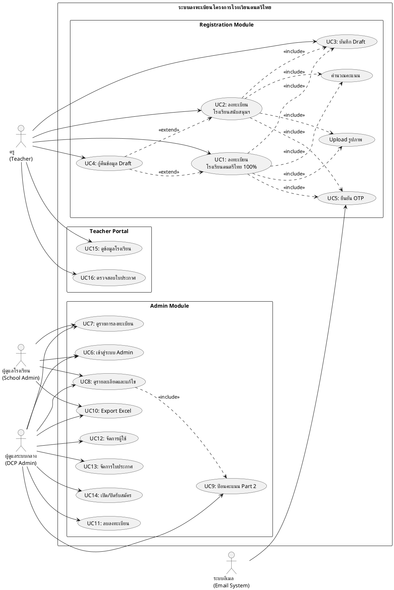
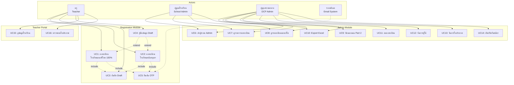

# Use Case Diagram - Thai Music Platform Registration System

**System Name**: ระบบลงทะเบียนโครงการโรงเรียนดนตรีไทย  
**Version**: 1.0  
**Date**: July 27, 2026

---

## Actors (ผู้ใช้งานระบบ)

### 1. ครู (Teacher)
- บุคคลที่ต้องการลงทะเบียนโรงเรียน
- ใช้ระบบผ่าน public website
- ไม่ต้อง login ก่อนลงทะเบียน

### 2. ผู้ดูแลระบบโรงเรียน (School Admin)
- ผู้ดูแลในสังกัด (เช่น สำนักงานเขตพื้นที่)
- จัดการข้อมูลโรงเรียนในความรับผิดชอบ
- ดูรายงานและสถิติ

### 3. ผู้ดูแลระบบกลาง (DCP Admin / Super Admin)
- ผู้ดูแลระดับประเทศ
- มีสิทธิ์เข้าถึงข้อมูลทั้งหมด
- จัดการระบบ, ผู้ใช้, และใบประกาศ

### 4. ระบบอีเมล (Email System)
- ส่งอีเมล OTP
- ส่งข้อมูล login
- ส่งการแจ้งเตือน

---

## Use Cases - Registration Module

### Use Case 1: ลงทะเบียนโรงเรียนดนตรีไทย 100%
**Actor**: ครู  
**Description**: ครูกรอกแบบฟอร์มลงทะเบียนโรงเรียนดนตรีไทย 100% แบบ 9 ขั้นตอน

**Preconditions**:
- ระบบเปิดรับสมัคร

**Main Flow**:
1. ครูเข้าหน้าลงทะเบียน
2. ยอมรับเงื่อนไข PDPA
3. กรอกข้อมูลขั้นตอนที่ 1-9
4. ระบบบันทึกเป็น draft อัตโนมัติ
5. ส่งแบบฟอร์ม
6. ยืนยัน OTP
7. ระบบสร้าง School ID
8. ระบบคำนวณคะแนน Part 1
9. ระบบสร้างบัญชีครู
10. ส่งอีเมลข้อมูล login

**Postconditions**:
- ข้อมูลลงทะเบียนถูกบันทึก (status: pending)
- School ID ถูกสร้าง (DCP-XXXX)
- บัญชีครูถูกสร้าง
- อีเมลถูกส่งไปยังครู

**Includes**:
- <<include>> บันทึก Draft
- <<include>> ยืนยัน OTP
- <<include>> Upload รูปภาพ
- <<include>> คำนวณคะแนน

**Extends**:
- <<extend>> กู้คืนข้อมูล Draft

---

### Use Case 2: ลงทะเบียนโรงเรียนสนับสนุนและส่งเสริม
**Actor**: ครู  
**Description**: ครูกรอกแบบฟอร์มลงทะเบียนโรงเรียนสนับสนุนฯ

**Main Flow**: (เหมือน Use Case 1)

**Differences**:
- เลือกประเภทการสนับสนุน (สถานศึกษา/ชุมนุม/ชมรม/กลุ่ม/วงดนตรี)
- คะแนนเต็ม 180 (แทน 200)
- มีคะแนนการฝึกอบรมครู (แทนหลักสูตร)

---

### Use Case 3: บันทึก Draft
**Actor**: ครู  
**Description**: บันทึกข้อมูลเป็น draft เพื่อกรอกต่อในภายหลัง

**Main Flow**:
1. ครูกรอกข้อมูลบางส่วน
2. กดปุ่ม "บันทึก" หรือระบบ auto-save
3. ระบบสร้าง draft token (UUID)
4. บันทึกข้อมูลและสถานะปัจจุบัน
5. แสดง URL สำหรับกลับมากรอกต่อ

**Postconditions**:
- Draft ถูกบันทึก (หมดอายุ 7 วัน)
- ครูได้รับ draft URL

**Rate Limit**: 5 ครั้ง/ชั่วโมง

---

### Use Case 4: กู้คืนข้อมูล Draft
**Actor**: ครู  
**Description**: กลับมากรอกข้อมูลต่อจาก draft ที่บันทึกไว้

**Main Flow**:
1. ครูเข้า draft URL
2. ระบบโหลดข้อมูลจาก draft token
3. แสดงแบบฟอร์มพร้อมข้อมูลเดิม
4. ครูกรอกข้อมูลต่อ
5. บันทึกหรือส่งแบบฟอร์ม

**Preconditions**:
- Draft ยังไม่หมดอายุ (< 7 วัน)
- Draft status = active

---

### Use Case 5: ยืนยัน OTP
**Actor**: ครู, ระบบอีเมล  
**Description**: ยืนยัน OTP ก่อนส่งแบบฟอร์ม

**Main Flow**:
1. ครูกดปุ่ม "ส่งแบบฟอร์ม"
2. ระบบสร้าง OTP 6 หลัก

3. ส่ง OTP ทางอีเมล
4. ครูกรอก OTP
5. ระบบตรวจสอบ OTP
6. ยืนยันและส่งแบบฟอร์ม

**Postconditions**:
- OTP ถูกยืนยัน
- แบบฟอร์มถูกส่ง

**Rate Limit**: 
- ขอ OTP: 3 ครั้ง/ชั่วโมง
- กรอก OTP: 5 ครั้ง/OTP

**OTP Expiry**: 5 นาที

---

## Use Cases - Admin Module

### Use Case 6: เข้าสู่ระบบ Admin
**Actor**: School Admin, DCP Admin  
**Description**: Login เข้าสู่ระบบ Dashboard

**Main Flow**:
1. เข้าหน้า login (/login หรือ /dcp-admin)
2. กรอก email และ password
3. ระบบตรวจสอบ credentials
4. ระบบสร้าง session
5. Redirect ไปยัง Dashboard

**Postconditions**:
- Session ถูกสร้าง (24 ชั่วโมง)
- เข้าสู่ Dashboard ตาม role

---

### Use Case 7: ดูรายการลงทะเบียน
**Actor**: School Admin, DCP Admin  
**Description**: ดูรายการโรงเรียนที่ลงทะเบียน

**Main Flow**:
1. เข้าหน้า Dashboard
2. เลือกประเภท (Register100/Register-Support)
3. กรอง/ค้นหาข้อมูล
4. ดูรายการโรงเรียน

**Features**:
- Search (ชื่อโรงเรียน, School ID)
- Filter (จังหวัด, ระดับการศึกษา, เกณฑ์)
- Pagination
- Export Excel (CSV with score details)

---

### Use Case 8: ดูรายละเอียดและแก้ไขลงทะเบียน
**Actor**: School Admin, DCP Admin  
**Description**: ดูและแก้ไขข้อมูลลงทะเบียนโรงเรียน

**Main Flow**:
1. คลิก "View" หรือ "Edit" จากรายการ
2. ดูข้อมูลทั้งหมด 9 ขั้นตอน
3. แก้ไขข้อมูล
4. บันทึกการเปลี่ยนแปลง
5. ระบบคำนวณคะแนนใหม่ (ถ้าไม่ใช่ manual edit)

**Special Features**:
- Manual Edit Mode: เก็บคะแนนเดิม (สำหรับแก้ไข video scores)
- Normal Edit: คำนวณคะแนน Part 1 ใหม่, เก็บ Part 2

**Includes**:
- <<include>> ป้อนคะแนน Part 2
- <<include>> เพิ่มหมายเหตุ (adminNotes)

---

### Use Case 9: ป้อนคะแนน Part 2 (Video Scores)
**Actor**: DCP Admin  
**Description**: ป้อนคะแนนการประเมินวิดีโอ

**Main Flow**:
1. เข้าหน้าแก้ไขลงทะเบียน
2. ดูลิงก์วิดีโอที่ 1 และ 2
3. ประเมินและให้คะแนน
4. ป้อน video1_score และ video2_score
5. บันทึก (manual edit mode)

**Score Ranges**:
- Register100: video1 (0-50), video2 (0-50)
- Register-Support: video1 (0-40), video2 (0-40)

**Postconditions**:
- คะแนนรวมถูกอัพเดท
- เกรดถูกคำนวณใหม่

---

### Use Case 10: Export ข้อมูลเป็น Excel
**Actor**: School Admin, DCP Admin  
**Description**: Export รายการโรงเรียนเป็นไฟล์ CSV พร้อมคะแนนละเอียด

**Main Flow**:
1. กรอง/ค้นหาข้อมูลที่ต้องการ
2. กดปุ่ม "Export Excel"
3. ระบบสร้างไฟล์ CSV (client-side)
4. Download ไฟล์

**Export Format**:
- 23 columns (ข้อมูลพื้นฐาน + คะแนนทุกส่วน + subtotals)
- UTF-8 with BOM (รองรับภาษาไทย)
- Filename: `register100_schools_YYYYMMDD_HHmmss.csv`

---

### Use Case 11: ลบลงทะเบียน
**Actor**: DCP Admin  
**Description**: ลบข้อมูลลงทะเบียน (Hard Delete)

**Main Flow**:
1. คลิก "Delete" จากรายการ
2. ยืนยันการลบ
3. ระบบลบข้อมูลถาวร

**Postconditions**:
- ข้อมูลลงทะเบียนถูกลบ
- บัญชีครู (ถ้ามี) ยังคงอยู่

---

### Use Case 12: จัดการผู้ใช้
**Actor**: DCP Admin  
**Description**: สร้าง, แก้ไข, ลบบัญชีผู้ใช้

**Main Flow**:
1. เข้าหน้า User Management
2. ดูรายการผู้ใช้
3. สร้าง/แก้ไข/ลบผู้ใช้
4. ส่งข้อมูล login ทางอีเมล

**User Roles**:
- admin (School Admin)
- super_admin (DCP Admin)
- teacher (ครู)

**Includes**:
- <<include>> รีเซ็ตรหัสผ่าน
- <<include>> ส่งข้อมูล login ใหม่

---

### Use Case 13: จัดการใบประกาศนียบัตร
**Actor**: DCP Admin  
**Description**: สร้างและจัดการใบประกาศ

**Main Flow**:
1. เลือกโรงเรียนที่ผ่านเกณฑ์
2. เลือก template ใบประกาศ
3. สร้างใบประกาศ
4. ระบบสร้างเลขที่ใบประกาศ
5. บันทึกและแจ้งเตือนครู

**Certificate Number Format**: `CERT-{ปีไทย}-{timestamp}{random}`

---

### Use Case 14: เปิด/ปิดรับสมัคร
**Actor**: DCP Admin  
**Description**: ควบคุมการเปิด/ปิดรับสมัคร

**Main Flow**:
1. เข้าหน้า Registration Control
2. Toggle สถานะรับสมัคร
3. บันทึกการตั้งค่า

**Settings**:
- register100Open (boolean)
- registerSupportOpen (boolean)

---

## Use Cases - Teacher Portal

### Use Case 15: ดูข้อมูลโรงเรียนของตนเอง
**Actor**: ครู (logged in)  
**Description**: ครูเข้าสู่ระบบเพื่อดูข้อมูลลงทะเบียน

**Main Flow**:
1. Login ด้วย email/password (ที่ได้รับทางอีเมล)
2. เข้า Teacher Dashboard
3. ดูข้อมูลโรงเรียน
4. ดูคะแนนและเกรด

**Features**:
- ดูข้อมูลลงทะเบียนทั้งหมด
- ดูคะแนนแต่ละส่วน
- ดูสถานะการอนุมัติ
- ดู/ดาวน์โหลดใบประกาศ (ถ้ามี)

---

### Use Case 16: ตรวจสอบใบประกาศนียบัตร
**Actor**: Public, ครู  
**Description**: ตรวจสอบความถูกต้องของใบประกาศ

**Main Flow**:
1. เข้าหน้า Certificate Verification
2. กรอกเลขที่ใบประกาศ
3. ระบบค้นหาและแสดงผล
4. ดูรายละเอียดใบประกาศ

**Postconditions**:
- แสดงข้อมูลใบประกาศ (ถ้าพบ)
- แสดงข้อความแจ้งเตือน (ถ้าไม่พบ)

---

## PlantUML Diagram Code

สำหรับสร้างภาพ Use Case Diagram ใน MS Word หรือเครื่องมืออื่น:

---

## Mermaid Diagram Code

สำหรับใช้กับ AI tools ที่รองรับ Mermaid:

---

## Text-Based Diagram for AI Generation

คำอธิบายสำหรับให้ AI สร้างภาพ:

**System**: Thai Music Platform Registration System

**Actors**:
1. ครู (Teacher) - ด้านซ้ายบน
2. ผู้ดูแลโรงเรียน (School Admin) - ด้านซ้ายกลาง
3. ผู้ดูแลระบบกลาง (DCP Admin) - ด้านซ้ายล่าง
4. ระบบอีเมล (Email System) - ด้านขวาบน

**System Boundary**: กรอบสี่เหลี่ยม "ระบบลงทะเบียนโครงการโรงเรียนดนตรีไทย"

**Use Cases** (จัดเป็น 3 กลุ่ม):

**กลุ่ม 1: Registration Module** (บนซ้าย)
- UC1: ลงทะเบียนโรงเรียนดนตรีไทย 100%
- UC2: ลงทะเบียนโรงเรียนสนับสนุนฯ
- UC3: บันทึก Draft
- UC4: กู้คืนข้อมูล Draft
- UC5: ยืนยัน OTP
- Upload รูปภาพ
- คำนวณคะแนน

**กลุ่ม 2: Admin Module** (กลาง)
- UC6: เข้าสู่ระบบ Admin
- UC7: ดูรายการลงทะเบียน
- UC8: ดูรายละเอียดและแก้ไข
- UC9: ป้อนคะแนน Part 2
- UC10: Export Excel
- UC11: ลบลงทะเบียน
- UC12: จัดการผู้ใช้
- UC13: จัดการใบประกาศ
- UC14: เปิด/ปิดรับสมัคร

**กลุ่ม 3: Teacher Portal** (ขวาล่าง)
- UC15: ดูข้อมูลโรงเรียน
- UC16: ตรวจสอบใบประกาศ

**Relationships**:

**Association (เส้นทึบ)**:
- Teacher → UC1, UC2, UC3, UC4, UC15, UC16
- School Admin → UC6, UC7, UC8, UC10
- DCP Admin → UC6, UC7, UC8, UC9, UC10, UC11, UC12, UC13, UC14
- Email System → UC5

**Include (เส้นประ <<include>>)**:
- UC1 → UC3, UC5, Upload, คำนวณคะแนน
- UC2 → UC3, UC5, Upload, คำนวณคะแนน
- UC8 → UC9

**Extend (เส้นประ <<extend>>)**:
- UC4 → UC1, UC2

---

## Summary Table

| Use Case ID | Use Case Name | Primary Actor | Type |
|-------------|---------------|---------------|------|
| UC1 | ลงทะเบียนโรงเรียนดนตรีไทย 100% | ครู | Core |
| UC2 | ลงทะเบียนโรงเรียนสนับสนุนฯ | ครู | Core |
| UC3 | บันทึก Draft | ครู | Supporting |
| UC4 | กู้คืนข้อมูล Draft | ครู | Supporting |
| UC5 | ยืนยัน OTP | ครู, Email System | Supporting |
| UC6 | เข้าสู่ระบบ Admin | Admin | Core |
| UC7 | ดูรายการลงทะเบียน | Admin | Core |
| UC8 | ดูรายละเอียดและแก้ไข | Admin | Core |
| UC9 | ป้อนคะแนน Part 2 | DCP Admin | Core |
| UC10 | Export Excel | Admin | Supporting |
| UC11 | ลบลงทะเบียน | DCP Admin | Core |
| UC12 | จัดการผู้ใช้ | DCP Admin | Admin |
| UC13 | จัดการใบประกาศ | DCP Admin | Core |
| UC14 | เปิด/ปิดรับสมัคร | DCP Admin | Admin |
| UC15 | ดูข้อมูลโรงเรียน | ครู (logged in) | Core |
| UC16 | ตรวจสอบใบประกาศ | Public | Supporting |

---

**END OF DOCUMENT**
